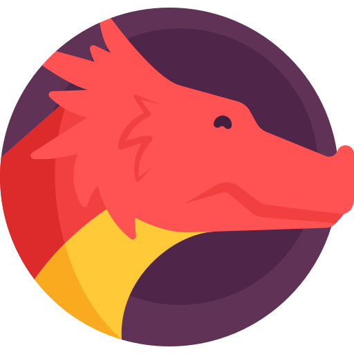

# 🐉 Traveling Dragon — Projeto Final PDSII 2025/1



## 🎮 Visão Geral

**Traveling Dragon** é uma releitura autoral do clássico Flappy Bird. Neste jogo, você controla um **dragão aventureiro** que sai de sua caverna para explorar o mundo. A cada novo cenário, o tempo passa mais rápido, o dia clareia, escurece, e por fim o dragão mergulha em uma noite eterna, repleta de obstáculos desafiadores.

Este projeto foi desenvolvido em **C++**, utilizando a biblioteca **Allegro 5**, como parte da disciplina **Programação e Desenvolvimento de Software II (PDSII)** na **UFMG**.

---

## 🧱 Estrutura do Sistema

### Arquitetura Orientada a Objetos

- `GameEngine`: controla o loop principal, os estados do jogo e transições de telas.
- `Menu`, `ConfigScreen`, `GameOverScreen`: interfaces gráficas com suporte ao mouse.
- `Scenario`: gerencia obstáculos (`Pipe`) e mudanças de cenário com velocidade progressiva.
- `Bird` (Dragão): personagem controlável, com sprites distintos para subida e queda.
- `Pipe`: obstáculos com gaps aleatórios e movimentação suave.
- `Player` e `PlayerManager`: cadastro, estatísticas e ranking persistente dos jogadores.
- `GameObject`: classe base abstrata para elementos visuais e lógicos.

### Cadastro e Ranking

- Jogador insere apelido ao iniciar o jogo.
- Dados persistentes: nome, apelido, partidas jogadas e maior pontuação.
- Ranking exibido graficamente no menu e na tela de Game Over.

---

## ✨ Funcionalidades

### Funcionalidades Básicas

- Controle via **barra de espaço** para manter o dragão voando.
- Sistema de **pontuação** baseado em canos ultrapassados.
- **Geração aleatória** de obstáculos.
- **Ranking persistente** em arquivo de texto.

### Funcionalidades Extras

- ✅ **Gráficos** totalmente novos e pensados para criação de uma história.
- ✅ **Trilha sonora** e **Efeitos Sonoros** criados para o jogo.
- ✅ **Menu Principal** antes de iniciar o jogo.
- ✅ **Transição com fade** entre cenários e ao iniciar o jogo.
- ✅ **Velocidade progressiva** dos obstáculos a cada novo cenário.
- ✅ **Animação** com sprites.
- ✅ **7 cenários diferentes**, sendo o último uma **noite infinita com pipes infinitos**.
- ✅ **Seleção de resolução e modo de janela** antes de começar.
- ✅ Interface com suporte completo a **mouse**.
- ✅ **Ícone personalizado** do jogo.

---

## 🧪 Testes e Validação

Este projeto utiliza **testes unitários com [Doctest](https://github.com/doctest/doctest)** para validar a lógica das classes principais que não dependem diretamente da biblioteca Allegro.

### Testes implementados:
- 📋 Cadastro de jogadores (`test_PlayerManager.cpp`)
- 🧠 Lógica de pontuação e avanço de cenário (`test_Scenario.cpp`)
- 🧪 Entrada principal de testes (`test_main.cpp`)

### Como executar:
No terminal, na raiz do projeto:

```bash
mingw32-make test
```

Isso compilará os testes da pasta `tests/` e executará o binário `bin/run_tests.exe`.

---

## 📚 Documentação

O projeto já contém a documentação gerada com **[Doxygen](https://www.doxygen.nl/)** disponível na pasta `docs/`.

Ela foi gerada com base em comentários padrão Doxygen presentes nos arquivos `.hpp` e `.cpp` do projeto, incluindo as principais classes, métodos e estruturas.

> 📁 Para acessar, basta abrir o arquivo:  
> `docs/html/index.html`

---

## 📂 Estrutura do Projeto

```
pds2_projeto_final/
├── assets/         # Sprites, fontes, ícone e imagens
├── bin/            # Executável do jogo ("Traveling Dragon")
├── include/        # Arquivos .hpp
├── obj/            # Arquivos compilados
├── src/            # Código-fonte .cpp
├── tests/          # Testes unitários
├── players.txt     # Dados dos jogadores
├── docs/           # Documentação gerada com Doxygen
├── Makefile        # Build
└── README.md       # Este arquivo
```

---

## ▶️ Como Jogar

1. Acesse a pasta `bin/`
2. **Execute o arquivo `Traveling Dragon.exe`**
3. Divirta-se controlando o dragão com a sua barra de espaço, evite obstáculos e avance pelos cenários!

---

## 🖼️ Demonstração do Jogo


## ⚠️ Dificuldades Encontradas

Durante o desenvolvimento do **Traveling Dragon**, diversos desafios técnicos e conceituais foram superados com atenção, refatorações e testes progressivos:

- 🧱 **Colisão com o teto** exigiu refinamento das bounding boxes para evitar falsos positivos.
- 🌗 **Transições com fade** ao trocar de cenário ou iniciar o jogo precisaram ser sincronizadas com o estado interno do motor (`GameEngine`) para evitar artefatos visuais como tela preta.
- 💾 **Persistência de jogadores** exigiu leitura e escrita cuidadosa no arquivo `players.txt`, garantindo ordenação, não duplicação e atualização de dados.
- 🔀 **Integração de mouse e teclado simultaneamente** exigiu estrutura híbrida no `GameEngine` para lidar com múltiplos tipos de entrada.
- ⚙️ **Integração de testes com Doctest** e ajustes no **Makefile** para suportar compilação separada, linking correto, e execução dos testes sem a interface gráfica.

Esses obstáculos foram superados com persistência, modularização do código e testes manuais e automatizados constantes, resultando em um jogo autoral estável e funcional.

---

## 👨‍💻 Autor

Gabriel Rocha de Ascenção

Orientado pelos professores:
- Luiz Chaimowicz
- Héctor Azpúrua

Departamento de Ciência da Computação – UFMG  
Curso: Matemática Computacional – 1º semestre de 2025

---

## 📎 Referências

- [Allegro 5 — Site oficial](https://liballeg.org/)
- [Doxygen — Manual](https://www.doxygen.nl/manual/docblocks.html)
- [Doctest — GitHub](https://github.com/doctest/doctest)